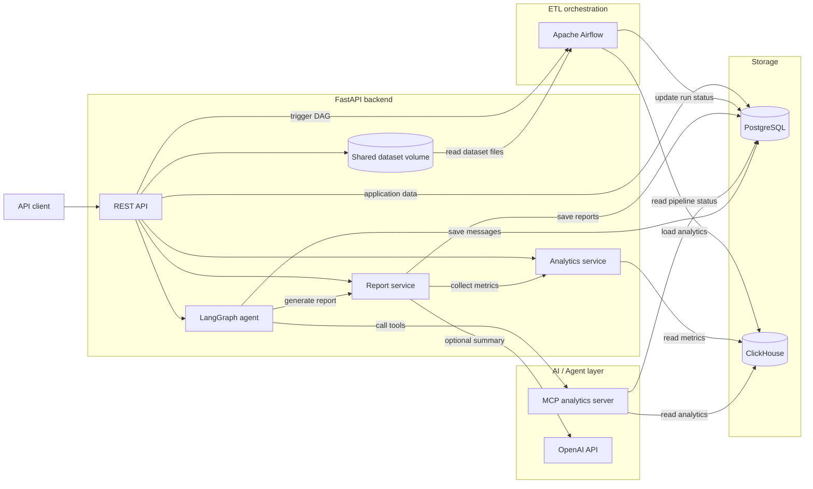

[English](https://github.com/8-mile-code/insightops-ai/blob/main/README.md) | [Русский](https://github.com/8-mile-code/insightops-ai/blob/main/README.ru.md)

# InsightOps AI

InsightOps AI is a backend platform that turns order datasets into validated
analytics, persisted reports, and grounded agent answers.

A user uploads a CSV file, starts an Apache Airflow pipeline through the API,
and then explores the processed data through analytics endpoints, generated
business reports, or a LangGraph agent backed by MCP tools.

> This is an educational portfolio project focused on backend architecture,
> data engineering, analytical storage, and AI integration.

## Contents

- [Features](#features)
- [Architecture](#architecture)
- [Why These Technologies](#why-these-technologies)
- [Technology Stack](#technology-stack)
- [Quick Start](#quick-start)
- [Demo Scenario](#demo-scenario)
- [API Overview](#api-overview)
- [Agent and MCP](#agent-and-mcp)
- [Development](#development)
- [Testing](#testing)
- [Project Structure](#project-structure)
- [Screenshots](#screenshots)
- [Roadmap](#roadmap)

## Features

- JWT authentication with Argon2 password hashing.
- User-owned projects with resource-level access checks.
- CSV dataset upload and validation with structured validation errors.
- FastAPI-triggered Airflow pipeline runs with persisted run status.
- ETL tasks for extraction, validation, transformation, aggregation, and load.
- Operational metadata stored in PostgreSQL.
- Order events and analytical aggregates stored in ClickHouse.
- Analytics endpoints for revenue, order status, failed payments, and top
  customers.
- Deterministic report fallback with optional OpenAI-generated summaries.
- LangGraph workflow for routing analytical questions to tools.
- MCP tools with structured results, source metadata, and direct fallbacks.
- Persisted agent messages, tool usage, sources, and generated report links.
- Structured application logging with request IDs and domain error codes.
- Docker Compose startup with health checks, migrations, and database
  initialization.

## Architecture



### Dataset Processing Flow

1. FastAPI accepts a dataset and stores its metadata in PostgreSQL.
2. The backend creates a `pipeline_run` and triggers the Airflow public API.
3. The `process_dataset` DAG reads the CSV from the shared upload volume.
4. Airflow validates required columns and row values.
5. Valid rows are normalized and transformed into order events.
6. The DAG calculates daily revenue, failed payments, top customers, and
   orders grouped by status.
7. Events and aggregates are loaded into ClickHouse.
8. Airflow marks the pipeline run and dataset as successful in PostgreSQL.
9. Analytics, report, and agent endpoints query the processed data.

### Data Ownership

PostgreSQL is the source of truth for application state:

- users;
- projects;
- datasets;
- pipeline runs;
- reports;
- agent message history.

ClickHouse is the analytical store for:

- `orders_events`;
- `daily_revenue`;
- `failed_payments`;
- `top_customers`;
- `orders_by_status`.

## Why These Technologies

### Apache Airflow

Airflow owns orchestration rather than HTTP request handling. It makes every
ETL stage visible, retryable, and independently observable while PostgreSQL
keeps the application-facing pipeline status. FastAPI triggers the DAG through
Airflow's authenticated API instead of executing data processing inside the
web request.

### ClickHouse

PostgreSQL stores transactional application data, while ClickHouse serves
analytical reads. The pipeline writes both normalized order events and
precomputed aggregates, allowing API queries to filter by project, dataset,
and pipeline run without scanning application tables.

### LangGraph

The agent is implemented as an explicit workflow:

```text
parse question -> choose action -> execute tool -> format answer
```

This keeps routing and state transitions inspectable. The current router is
deterministic and supports revenue, order status, failed payments, top
customers, period comparison, pipeline status, and report requests.

### Model Context Protocol

MCP separates agent orchestration from analytics tool implementations. The
backend starts the analytics MCP server over stdio, receives structured tool
results, and records both the selected tool and its data sources. Selected
analytics actions have direct repository fallbacks if an MCP call fails.

### OpenAI API

LLM usage is optional. When enabled, the report service sends a structured
metrics snapshot to the configured OpenAI model. If the provider is disabled
or unavailable, the service stores a deterministic report instead, so the
core reporting flow does not depend on an external API.

## Technology Stack

| Area | Technology | Purpose |
| --- | --- | --- |
| API | FastAPI, Uvicorn, Pydantic | Async HTTP API and validation |
| Persistence | PostgreSQL, SQLAlchemy, asyncpg | Operational application data |
| Migrations | Alembic | PostgreSQL schema evolution |
| Orchestration | Apache Airflow 3, LocalExecutor | ETL scheduling and task state |
| Analytics | ClickHouse, clickhouse-connect | Events, aggregates, analytical reads |
| Agent | LangGraph | Explicit analytical agent workflow |
| Tool protocol | MCP Python SDK | Structured analytics tools over stdio |
| AI | OpenAI Responses API | Optional report summarization |
| Security | JWT, Argon2 | Authentication and password hashing |
| Quality | pytest, pytest-asyncio, Ruff | Tests, linting, and formatting |
| Infrastructure | Docker Compose, uv | Reproducible local environment |

## Quick Start

### Prerequisites

- Docker with Docker Compose;
- Git;
- `curl` for the demo requests.

Python 3.14 and `uv` are only required for running development commands outside
Docker.

### Start the Stack

```bash
git clone https://github.com/8-mile-code/insightops-ai.git
cd insightops-ai
cp .env.example .env
make docker-up
```

`make docker-up` builds the backend and Airflow images, waits for PostgreSQL
and ClickHouse health checks, applies Alembic migrations, creates ClickHouse
tables, initializes Airflow, and starts the application services.

| Service | URL |
| --- | --- |
| FastAPI | http://localhost:8000 |
| Swagger UI | http://localhost:8000/docs |
| Airflow UI | http://localhost:8080 |
| PostgreSQL | `localhost:5432` |
| Airflow PostgreSQL | `localhost:5433` |
| ClickHouse HTTP | `localhost:8123` |

The development Airflow credentials from `.env.example` are:

```text
username: admin
password: airflow
```

The bundled SimpleAuthManager setup is intended for local development only.
Change all example secrets before using the project in another environment.

### Verify the Stack

```bash
curl http://localhost:8000/health
curl http://localhost:8000/db/ping
make docker-ps
make airflow-errors
```

Expected health responses:

```json
{"status":"ok"}
```

```json
{"status":"ok","result":1}
```

## Demo Scenario

The repository includes a valid order dataset at
`sample_data/orders_valid.csv`.

### 1. Register

```bash
curl -X POST http://localhost:8000/auth/register \
  -H "Content-Type: application/json" \
  -d '{
    "email": "demo@example.com",
    "password": "demo-password"
  }'
```

### 2. Log In

The login endpoint follows the OAuth2 password form convention. The email is
sent in the `username` field.

```bash
curl -X POST http://localhost:8000/auth/login \
  -H "Content-Type: application/x-www-form-urlencoded" \
  -d "username=demo@example.com&password=demo-password"
```

Copy `access_token` from the response:

```bash
export TOKEN="<access_token>"
```

### 3. Create a Project

```bash
curl -X POST http://localhost:8000/projects \
  -H "Authorization: Bearer $TOKEN" \
  -H "Content-Type: application/json" \
  -d '{
    "name": "Demo Analytics Project",
    "description": "Order analytics demo"
  }'
```

Copy the returned project ID:

```bash
export PROJECT_ID="<project_id>"
```

### 4. Upload the Dataset

```bash
curl -X POST \
  "http://localhost:8000/projects/$PROJECT_ID/datasets" \
  -H "Authorization: Bearer $TOKEN" \
  -F "file=@sample_data/orders_valid.csv"
```

Copy the returned dataset ID:

```bash
export DATASET_ID="<dataset_id>"
```

### 5. Start the Pipeline

```bash
curl -X POST \
  "http://localhost:8000/datasets/$DATASET_ID/process" \
  -H "Authorization: Bearer $TOKEN"
```

Copy `pipeline_run_id` from the `202 Accepted` response:

```bash
export PIPELINE_RUN_ID="<pipeline_run_id>"
```

### 6. Check Pipeline Status

```bash
curl \
  "http://localhost:8000/pipeline-runs/$PIPELINE_RUN_ID" \
  -H "Authorization: Bearer $TOKEN"
```

Wait until the response contains:

```json
{"status":"success"}
```

The Airflow UI also shows each extract, validate, transform, aggregate, load,
and finalize task for the same run.

### 7. Query Analytics

```bash
curl \
  "http://localhost:8000/projects/$PROJECT_ID/analytics/revenue/daily?dataset_id=$DATASET_ID&pipeline_run_id=$PIPELINE_RUN_ID" \
  -H "Authorization: Bearer $TOKEN"
```

The sample dataset produces:

```json
[
  {"date": "2026-01-01", "revenue": 210.49},
  {"date": "2026-01-03", "revenue": 150.0}
]
```

Other analytics endpoints:

```bash
curl \
  "http://localhost:8000/projects/$PROJECT_ID/analytics/orders/status?dataset_id=$DATASET_ID&pipeline_run_id=$PIPELINE_RUN_ID" \
  -H "Authorization: Bearer $TOKEN"

curl \
  "http://localhost:8000/projects/$PROJECT_ID/analytics/payments/failed?dataset_id=$DATASET_ID&pipeline_run_id=$PIPELINE_RUN_ID" \
  -H "Authorization: Bearer $TOKEN"

curl \
  "http://localhost:8000/projects/$PROJECT_ID/analytics/customers/top?dataset_id=$DATASET_ID&pipeline_run_id=$PIPELINE_RUN_ID&limit=5" \
  -H "Authorization: Bearer $TOKEN"
```

### 8. Generate a Report

```bash
curl -X POST \
  "http://localhost:8000/projects/$PROJECT_ID/reports/generate" \
  -H "Authorization: Bearer $TOKEN" \
  -H "Content-Type: application/json" \
  -d "{
    \"dataset_id\": $DATASET_ID,
    \"pipeline_run_id\": $PIPELINE_RUN_ID
  }"
```

With `LLM_ENABLED=False`, the endpoint returns a deterministic report. To use
OpenAI summaries, configure these values in `.env` and restart the backend:

```dotenv
LLM_ENABLED=True
LLM_PROVIDER=openai
LLM_MODEL=gpt-5.4-mini
OPENAI_API_KEY=your_api_key
```

### 9. Ask the Agent

```bash
curl -X POST \
  "http://localhost:8000/projects/$PROJECT_ID/agent/ask" \
  -H "Authorization: Bearer $TOKEN" \
  -H "Content-Type: application/json" \
  -d "{
    \"question\": \"Show revenue for this pipeline run\",
    \"dataset_id\": $DATASET_ID,
    \"pipeline_run_id\": $PIPELINE_RUN_ID
  }"
```

The response includes the answer, selected tools, and grounded sources:

```json
{
  "answer": "Daily revenue:\n- 2026-01-01: 210.49\n- 2026-01-03: 150.00",
  "used_tools": ["get_daily_revenue"],
  "sources": [
    {
      "type": "clickhouse_table",
      "name": "daily_revenue"
    }
  ]
}
```

Agent history is available at:

```bash
curl \
  "http://localhost:8000/projects/$PROJECT_ID/agent/messages" \
  -H "Authorization: Bearer $TOKEN"
```

## API Overview

All business endpoints require a bearer token unless noted otherwise.

| Method | Endpoint | Purpose |
| --- | --- | --- |
| `GET` | `/health` | Application health |
| `GET` | `/db/ping` | PostgreSQL connectivity |
| `POST` | `/auth/register` | Register a user |
| `POST` | `/auth/login` | Obtain a JWT |
| `GET` | `/auth/me` | Read the current user |
| `POST` | `/projects` | Create a project |
| `GET` | `/projects` | List owned projects |
| `POST` | `/projects/{id}/datasets` | Upload a dataset |
| `POST` | `/datasets/{id}/validate` | Validate a dataset directly |
| `POST` | `/datasets/{id}/process` | Trigger the Airflow pipeline |
| `GET` | `/pipeline-runs/{id}` | Read pipeline status and errors |
| `GET` | `/projects/{id}/analytics/revenue/daily` | Daily revenue |
| `GET` | `/projects/{id}/analytics/orders/status` | Orders by status |
| `GET` | `/projects/{id}/analytics/payments/failed` | Failed payments |
| `GET` | `/projects/{id}/analytics/customers/top` | Top customers |
| `POST` | `/projects/{id}/reports/generate` | Generate and persist a report |
| `POST` | `/projects/{id}/agent/ask` | Ask an analytics question |
| `GET` | `/projects/{id}/agent/messages` | Read saved agent history |

The complete interactive API reference is available at `/docs` after startup.

## Agent and MCP

The LangGraph state stores the question, selected action, filters, structured
tool result, used tools, sources, and final answer. Supported requests include:

```text
Show revenue for this pipeline run
Show orders by status
Show failed payments
Show top customers
Compare this pipeline run with another run
Show pipeline status
Generate a weekly business report
```

The MCP server currently exposes:

- `get_daily_revenue` from ClickHouse;
- `get_failed_payments` from ClickHouse;
- `get_top_customers` from ClickHouse;
- `get_pipeline_status` from PostgreSQL.

MCP results contain `data`, `sources`, and `metadata`. This lets the agent
produce grounded answers and persist where the information came from.

## Development

Install local dependencies with uv:

```bash
uv sync --dev
```

Useful commands:

```bash
make dev                              # Run FastAPI with reload
make lint                             # Run Ruff checks
make format                           # Format application code
make check                            # Run lint and tests
make migrate                          # Apply PostgreSQL migrations
make revision MESSAGE="description"   # Generate a migration
make docker-up                        # Build and start the stack
make docker-down                      # Stop the stack
make docker-logs                      # Follow service logs
make airflow-errors                   # List DAG import errors
make clickhouse-init                  # Create tables outside Compose
make seed-demo                        # Create optional demo records
```

The `make seed-demo` command creates:

- user `demo@insightops.com` with password `demo-password`;
- a demo project;
- a dataset record backed by `sample_data/orders_valid.csv`.

## Testing

Tests use a dedicated PostgreSQL database and include a guard that rejects a
test URL pointing at the main database.

Create the test database once when running tests locally:

```bash
docker exec -it insightops_postgres \
  createdb -U insightops insightops_test
```

Run the suite:

```bash
make test
```

The current suite contains 47 tests covering:

- health and authentication;
- project ownership;
- dataset and pipeline-run API behavior;
- structured error responses;
- dataset service behavior;
- pure ETL validation, transformation, and aggregation;
- analytics repository and service behavior.

## Project Structure

```text
app/
  agents/          LangGraph state, routing, tools, and result models
  api/routers/     FastAPI endpoints
  clients/         External service clients, including Airflow
  core/            Settings, security, logging, and error handling
  db/              PostgreSQL sessions and ClickHouse clients
  domain/          Pure testable ETL rules
  mcp_clients/     MCP stdio client
  mcp_servers/     Analytics MCP server and tools
  middleware/      Request context and request ID logging
  models/          SQLAlchemy models
  repositories/    PostgreSQL and ClickHouse data access
  schemas/         API request and response models
  services/        Application use cases
alembic/           PostgreSQL migrations
dags/              Airflow DAGs
docker/            Backend and Airflow images
sample_data/       Valid and invalid demo CSV files
scripts/           Database initialization and demo utilities
tests/             API, service, repository, and domain tests
```

## Screenshots

The primary operational interfaces are available after `make docker-up`:

- FastAPI Swagger UI: http://localhost:8000/docs
- Airflow DAG UI: http://localhost:8080

Release screenshots should show real local runs rather than generated UI
mockups: the Swagger endpoint catalog, a successful `process_dataset` DAG run,
an analytics response, and an agent response with its tools and sources.

## Roadmap

- Reuse `app/domain/orders_etl.py` directly from the Airflow image.
- Pass file or object-storage references between Airflow tasks instead of rows.
- Add object storage for uploaded datasets.
- Move ClickHouse queries behind an async integration boundary.
- Extend MCP coverage and add richer agent intent classification.
- Add a frontend analytics dashboard.
- Add metrics, tracing, and centralized observability.
- Add CI pipelines and deployment manifests.
- Add larger integration and end-to-end test suites.
