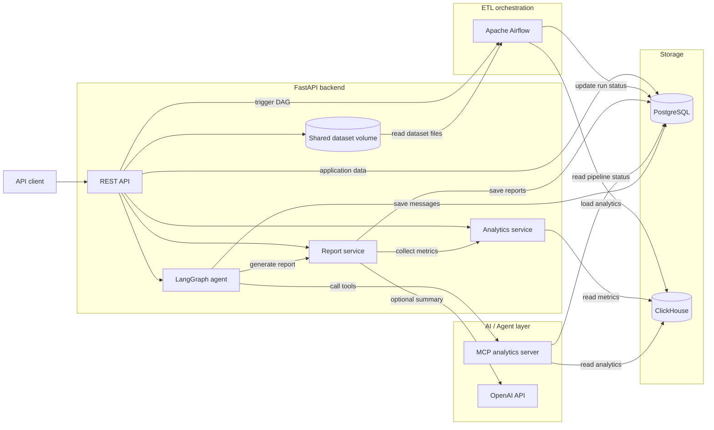

[English](https://github.com/8-mile-code/insightops-ai/blob/main/README.md) | [Русский](https://github.com/8-mile-code/insightops-ai/blob/main/README.ru.md)

# InsightOps AI

InsightOps AI — backend-платформа, которая превращает датасеты с заказами в
проверенную аналитику, сохранённые отчёты и обоснованные ответы аналитического
агента.

Пользователь загружает CSV-файл, запускает Apache Airflow pipeline через API,
после чего исследует обработанные данные через аналитические endpoints,
бизнес-отчёты или LangGraph-агента, использующего MCP tools.

> Это учебный pet-проект, сфокусированный на backend-архитектуре, data
> engineering, аналитических хранилищах и интеграции AI.

## Содержание

- [Возможности](#возможности)
- [Архитектура](#архитектура)
- [Зачем используются эти технологии](#зачем-используются-эти-технологии)
- [Технологический стек](#технологический-стек)
- [Быстрый старт](#быстрый-старт)
- [Демонстрационный сценарий](#демонстрационный-сценарий)
- [Обзор API](#обзор-api)
- [Agent и MCP](#agent-и-mcp)
- [Разработка](#разработка)
- [Тестирование](#тестирование)
- [Структура проекта](#структура-проекта)
- [Скриншоты](#скриншоты)
- [Roadmap](#roadmap)

## Возможности

- JWT-аутентификация и хеширование паролей с Argon2.
- Пользовательские проекты с проверкой ownership для каждого ресурса.
- Загрузка и валидация CSV с сохранением структурированных ошибок.
- Запуск Airflow pipeline через FastAPI и сохранение статуса обработки.
- ETL-задачи для извлечения, валидации, преобразования, агрегации и загрузки.
- Хранение операционных данных в PostgreSQL.
- Хранение событий заказов и аналитических агрегатов в ClickHouse.
- Endpoints для выручки, статусов заказов, неуспешных платежей и топ-клиентов.
- Детерминированные отчёты с опциональной генерацией текста через OpenAI.
- LangGraph workflow для маршрутизации аналитических вопросов.
- MCP tools со структурированными результатами, источниками и fallback.
- Сохранение истории агента, использованных tools, источников и отчётов.
- Структурированное логирование с request ID и предметными кодами ошибок.
- Запуск через Docker Compose с healthchecks, миграциями и инициализацией БД.

## Архитектура



### Поток обработки датасета

1. FastAPI принимает датасет и сохраняет его метаданные в PostgreSQL.
2. Backend создаёт `pipeline_run` и вызывает публичный API Airflow.
3. DAG `process_dataset` читает CSV из общего volume.
4. Airflow проверяет обязательные колонки и значения строк.
5. Валидные строки нормализуются и преобразуются в события заказов.
6. DAG рассчитывает дневную выручку, неуспешные платежи, топ-клиентов и
   количество заказов по статусам.
7. События и агрегаты загружаются в ClickHouse.
8. Airflow обновляет статусы pipeline run и датасета в PostgreSQL.
9. Analytics API, отчёты и агент используют обработанные данные.

### Разделение данных

PostgreSQL является источником истины для состояния приложения:

- пользователей;
- проектов;
- датасетов;
- запусков pipeline;
- отчётов;
- истории сообщений агента.

ClickHouse используется как аналитическое хранилище для таблиц:

- `orders_events`;
- `daily_revenue`;
- `failed_payments`;
- `top_customers`;
- `orders_by_status`.

## Зачем используются эти технологии

### Apache Airflow

Airflow отвечает за оркестрацию, а не за обработку внутри HTTP-запроса. Каждый
этап ETL виден отдельно, может иметь собственный статус и обрабатывает ошибку
независимо от других этапов. FastAPI запускает DAG через аутентифицированный
Airflow API, а PostgreSQL хранит понятный приложению статус pipeline run.

### ClickHouse

PostgreSQL хранит транзакционные данные приложения, а ClickHouse обслуживает
аналитические запросы. Pipeline записывает нормализованные события заказов и
готовые агрегаты. API может фильтровать их по проекту, датасету и конкретному
запуску pipeline, не сканируя операционные таблицы.

### LangGraph

Агент реализован как явный workflow:

```text
parse question -> choose action -> execute tool -> format answer
```

Так маршрутизация и переходы состояния остаются понятными и проверяемыми.
Текущий router поддерживает вопросы о выручке, статусах заказов, неуспешных
платежах, топ-клиентах, сравнении запусков, статусе pipeline и отчётах.

### Model Context Protocol

MCP отделяет оркестрацию агента от реализации аналитических tools. Backend
запускает analytics MCP server через stdio, получает структурированный результат
и сохраняет использованный tool вместе с источниками данных. Для части
аналитических операций предусмотрен прямой fallback через repository.

### OpenAI API

Использование LLM опционально. При включённой интеграции ReportService передаёт
структурированный snapshot метрик выбранной модели OpenAI. Если интеграция
выключена или внешний API недоступен, сохраняется детерминированный отчёт.
Основной reporting flow не зависит от доступности внешней модели.

## Технологический стек

| Область | Технология | Назначение |
| --- | --- | --- |
| API | FastAPI, Uvicorn, Pydantic | Асинхронный HTTP API и валидация |
| Persistence | PostgreSQL, SQLAlchemy, asyncpg | Операционные данные приложения |
| Миграции | Alembic | Изменение схемы PostgreSQL |
| Оркестрация | Apache Airflow 3, LocalExecutor | ETL и статусы задач |
| Аналитика | ClickHouse, clickhouse-connect | События, агрегаты и аналитические запросы |
| Agent | LangGraph | Явный workflow аналитического агента |
| Tool protocol | MCP Python SDK | Структурированные tools через stdio |
| AI | OpenAI Responses API | Опциональная генерация отчётов |
| Безопасность | JWT, Argon2 | Аутентификация и хеширование паролей |
| Качество | pytest, pytest-asyncio, Ruff | Тесты, lint и форматирование |
| Инфраструктура | Docker Compose, uv | Воспроизводимое локальное окружение |

## Быстрый старт

### Требования

- Docker с Docker Compose;
- Git;
- `curl` для выполнения demo-запросов.

Python 3.14 и `uv` нужны только для запуска development-команд вне Docker.

### Запуск стека

```bash
git clone https://github.com/8-mile-code/insightops-ai.git
cd insightops-ai
cp .env.example .env
make docker-up
```

`make docker-up` собирает образы backend и Airflow, ожидает healthchecks
PostgreSQL и ClickHouse, применяет Alembic-миграции, создаёт таблицы ClickHouse,
инициализирует Airflow и запускает сервисы приложения.

| Сервис | Адрес |
| --- | --- |
| FastAPI | http://localhost:8000 |
| Swagger UI | http://localhost:8000/docs |
| Airflow UI | http://localhost:8080 |
| PostgreSQL | `localhost:5432` |
| Airflow PostgreSQL | `localhost:5433` |
| ClickHouse HTTP | `localhost:8123` |

Локальные credentials Airflow из `.env.example`:

```text
username: admin
password: airflow
```

SimpleAuthManager и эти credentials предназначены только для локальной
разработки. Перед использованием в другом окружении замените примерные секреты.

### Проверка стека

```bash
curl http://localhost:8000/health
curl http://localhost:8000/db/ping
make docker-ps
make airflow-errors
```

Ожидаемые health-ответы:

```json
{"status":"ok"}
```

```json
{"status":"ok","result":1}
```

## Демонстрационный сценарий

В репозитории есть валидный набор заказов
`sample_data/orders_valid.csv`.

### 1. Регистрация

```bash
curl -X POST http://localhost:8000/auth/register \
  -H "Content-Type: application/json" \
  -d '{
    "email": "demo@example.com",
    "password": "demo-password"
  }'
```

### 2. Авторизация

Endpoint использует OAuth2 password form. Email передаётся в поле `username`.

```bash
curl -X POST http://localhost:8000/auth/login \
  -H "Content-Type: application/x-www-form-urlencoded" \
  -d "username=demo@example.com&password=demo-password"
```

Скопируйте `access_token` из ответа:

```bash
export TOKEN="<access_token>"
```

### 3. Создание проекта

```bash
curl -X POST http://localhost:8000/projects \
  -H "Authorization: Bearer $TOKEN" \
  -H "Content-Type: application/json" \
  -d '{
    "name": "Demo Analytics Project",
    "description": "Order analytics demo"
  }'
```

Сохраните идентификатор проекта:

```bash
export PROJECT_ID="<project_id>"
```

### 4. Загрузка датасета

```bash
curl -X POST \
  "http://localhost:8000/projects/$PROJECT_ID/datasets" \
  -H "Authorization: Bearer $TOKEN" \
  -F "file=@sample_data/orders_valid.csv"
```

Сохраните идентификатор датасета:

```bash
export DATASET_ID="<dataset_id>"
```

### 5. Запуск pipeline

```bash
curl -X POST \
  "http://localhost:8000/datasets/$DATASET_ID/process" \
  -H "Authorization: Bearer $TOKEN"
```

Сохраните `pipeline_run_id` из ответа `202 Accepted`:

```bash
export PIPELINE_RUN_ID="<pipeline_run_id>"
```

### 6. Проверка статуса pipeline

```bash
curl \
  "http://localhost:8000/pipeline-runs/$PIPELINE_RUN_ID" \
  -H "Authorization: Bearer $TOKEN"
```

Дождитесь статуса:

```json
{"status":"success"}
```

В Airflow UI для того же запуска отображаются задачи extract, validate,
transform, aggregate, load и finalize.

### 7. Получение аналитики

```bash
curl \
  "http://localhost:8000/projects/$PROJECT_ID/analytics/revenue/daily?dataset_id=$DATASET_ID&pipeline_run_id=$PIPELINE_RUN_ID" \
  -H "Authorization: Bearer $TOKEN"
```

Результат для demo-датасета:

```json
[
  {"date": "2026-01-01", "revenue": 210.49},
  {"date": "2026-01-03", "revenue": 150.0}
]
```

Остальные endpoints аналитики:

```bash
curl \
  "http://localhost:8000/projects/$PROJECT_ID/analytics/orders/status?dataset_id=$DATASET_ID&pipeline_run_id=$PIPELINE_RUN_ID" \
  -H "Authorization: Bearer $TOKEN"

curl \
  "http://localhost:8000/projects/$PROJECT_ID/analytics/payments/failed?dataset_id=$DATASET_ID&pipeline_run_id=$PIPELINE_RUN_ID" \
  -H "Authorization: Bearer $TOKEN"

curl \
  "http://localhost:8000/projects/$PROJECT_ID/analytics/customers/top?dataset_id=$DATASET_ID&pipeline_run_id=$PIPELINE_RUN_ID&limit=5" \
  -H "Authorization: Bearer $TOKEN"
```

### 8. Генерация отчёта

```bash
curl -X POST \
  "http://localhost:8000/projects/$PROJECT_ID/reports/generate" \
  -H "Authorization: Bearer $TOKEN" \
  -H "Content-Type: application/json" \
  -d "{
    \"dataset_id\": $DATASET_ID,
    \"pipeline_run_id\": $PIPELINE_RUN_ID
  }"
```

При `LLM_ENABLED=False` endpoint вернёт детерминированный отчёт. Для генерации
через OpenAI укажите в `.env` и перезапустите backend:

```dotenv
LLM_ENABLED=True
LLM_PROVIDER=openai
LLM_MODEL=gpt-5.4-mini
OPENAI_API_KEY=your_api_key
```

### 9. Вопрос агенту

```bash
curl -X POST \
  "http://localhost:8000/projects/$PROJECT_ID/agent/ask" \
  -H "Authorization: Bearer $TOKEN" \
  -H "Content-Type: application/json" \
  -d "{
    \"question\": \"Show revenue for this pipeline run\",
    \"dataset_id\": $DATASET_ID,
    \"pipeline_run_id\": $PIPELINE_RUN_ID
  }"
```

Ответ содержит текст, использованные tools и источники:

```json
{
  "answer": "Daily revenue:\n- 2026-01-01: 210.49\n- 2026-01-03: 150.00",
  "used_tools": ["get_daily_revenue"],
  "sources": [
    {
      "type": "clickhouse_table",
      "name": "daily_revenue"
    }
  ]
}
```

История агента доступна через:

```bash
curl \
  "http://localhost:8000/projects/$PROJECT_ID/agent/messages" \
  -H "Authorization: Bearer $TOKEN"
```

## Обзор API

Все бизнес-endpoints требуют bearer token, если не указано обратное.

| Метод | Endpoint | Назначение |
| --- | --- | --- |
| `GET` | `/health` | Проверка приложения |
| `GET` | `/db/ping` | Проверка PostgreSQL |
| `POST` | `/auth/register` | Регистрация пользователя |
| `POST` | `/auth/login` | Получение JWT |
| `GET` | `/auth/me` | Текущий пользователь |
| `POST` | `/projects` | Создание проекта |
| `GET` | `/projects` | Список проектов пользователя |
| `POST` | `/projects/{id}/datasets` | Загрузка датасета |
| `POST` | `/datasets/{id}/validate` | Прямая валидация датасета |
| `POST` | `/datasets/{id}/process` | Запуск Airflow pipeline |
| `GET` | `/pipeline-runs/{id}` | Статус и ошибки pipeline |
| `GET` | `/projects/{id}/analytics/revenue/daily` | Дневная выручка |
| `GET` | `/projects/{id}/analytics/orders/status` | Заказы по статусам |
| `GET` | `/projects/{id}/analytics/payments/failed` | Неуспешные платежи |
| `GET` | `/projects/{id}/analytics/customers/top` | Топ-клиенты |
| `POST` | `/projects/{id}/reports/generate` | Создание и сохранение отчёта |
| `POST` | `/projects/{id}/agent/ask` | Аналитический вопрос |
| `GET` | `/projects/{id}/agent/messages` | История агента |

Полная интерактивная документация доступна по адресу `/docs` после запуска.

## Agent и MCP

LangGraph state хранит вопрос, выбранное действие, фильтры, структурированный
результат tool, использованные tools, источники и итоговый ответ.

Примеры поддерживаемых вопросов:

```text
Show revenue for this pipeline run
Show orders by status
Show failed payments
Show top customers
Compare this pipeline run with another run
Show pipeline status
Generate a weekly business report
```

MCP server предоставляет tools:

- `get_daily_revenue` из ClickHouse;
- `get_failed_payments` из ClickHouse;
- `get_top_customers` из ClickHouse;
- `get_pipeline_status` из PostgreSQL.

MCP-результаты содержат `data`, `sources` и `metadata`. Благодаря этому агент
формирует обоснованные ответы и сохраняет происхождение данных.

## Разработка

Установка локальных зависимостей через uv:

```bash
uv sync --dev
```

Полезные команды:

```bash
make dev                              # FastAPI с reload
make lint                             # Проверки Ruff
make format                           # Форматирование кода
make check                            # Lint и тесты
make migrate                          # Применение миграций PostgreSQL
make revision MESSAGE="description"   # Генерация миграции
make docker-up                        # Сборка и запуск стека
make docker-down                      # Остановка стека
make docker-logs                      # Логи сервисов
make airflow-errors                   # Ошибки импорта DAG
make clickhouse-init                  # Создание таблиц вне Compose
make seed-demo                        # Создание demo-данных
```

`make seed-demo` создаёт:

- пользователя `demo@insightops.com` с паролем `demo-password`;
- demo-проект;
- запись датасета на основе `sample_data/orders_valid.csv`.

## Тестирование

Тесты используют отдельную базу PostgreSQL. В `conftest.py` есть защита,
которая не позволяет запустить suite против основной базы.

Однократно создайте тестовую базу при локальном запуске:

```bash
docker exec -it insightops_postgres \
  createdb -U insightops insightops_test
```

Запуск suite:

```bash
make test
```

Текущий suite содержит 47 тестов и проверяет:

- health и аутентификацию;
- ownership проектов;
- API датасетов и pipeline runs;
- структурированные ошибки;
- DatasetService;
- чистую ETL-валидацию, трансформацию и агрегацию;
- AnalyticsRepository и AnalyticsService.

## Структура проекта

```text
app/
  agents/          LangGraph state, routing, tools и result models
  api/routers/     FastAPI endpoints
  clients/         Клиенты внешних сервисов, включая Airflow
  core/            Settings, security, logging и error handling
  db/              PostgreSQL sessions и ClickHouse clients
  domain/          Чистые тестируемые ETL-правила
  mcp_clients/     MCP stdio client
  mcp_servers/     Analytics MCP server и tools
  middleware/      Request context и request ID logging
  models/          SQLAlchemy models
  repositories/    Доступ к PostgreSQL и ClickHouse
  schemas/         API request и response models
  services/        Сценарии приложения
alembic/           Миграции PostgreSQL
dags/              Airflow DAGs
docker/            Образы backend и Airflow
sample_data/       Валидные и невалидные demo CSV
scripts/           Инициализация баз и demo utilities
tests/             API, service, repository и domain tests
```

## Скриншоты

После `make docker-up` доступны основные операционные интерфейсы:

- FastAPI Swagger UI: http://localhost:8000/docs
- Airflow DAG UI: http://localhost:8080

Скриншоты релиза должны показывать реальные локальные запуски: каталог Swagger
endpoints, успешный DAG `process_dataset`, аналитический ответ и ответ агента с
использованными tools и источниками.

## Roadmap

- Использовать `app/domain/orders_etl.py` напрямую из Airflow image.
- Передавать между Airflow tasks ссылки на файлы или object storage вместо строк.
- Добавить object storage для загруженных датасетов.
- Расширить MCP tools и классификацию намерений агента.
- Добавить frontend dashboard для аналитики.
- Добавить metrics, tracing и централизованную observability.
- Настроить CI pipelines и deployment manifests.
- Расширить integration и end-to-end tests.
